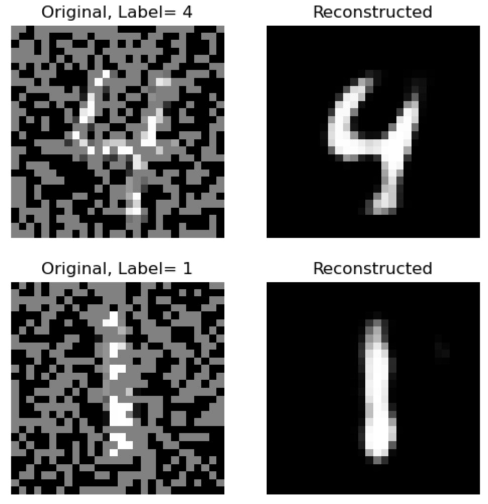

# Autoencoders

## Implementation of AutoEncoders from scratch using PyTorch

We implement 3 types of AutoEncoders on the MNIST handwritten digits dataset:
- Simple AutoEncoder
- De-Noising AutoEncoder
- Variational AutoEncoder

Implementation of Variational AutoEncoder has been inspired from the original AutoEncoder paper named "[Auto-Encoding Variational Bayes](https://arxiv.org/abs/1312.6114v10)".

Here are some demonstration from the codes:

- Reconstruction of Simple AutoEncoder:

- Reconstruction of De-Noising AutoEncoder:

- Interpolation by Variational AutoEncoder:
