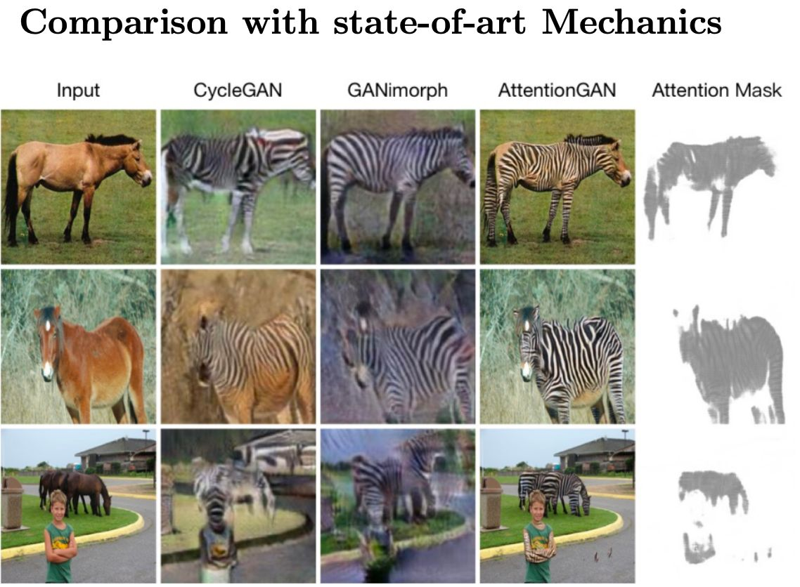
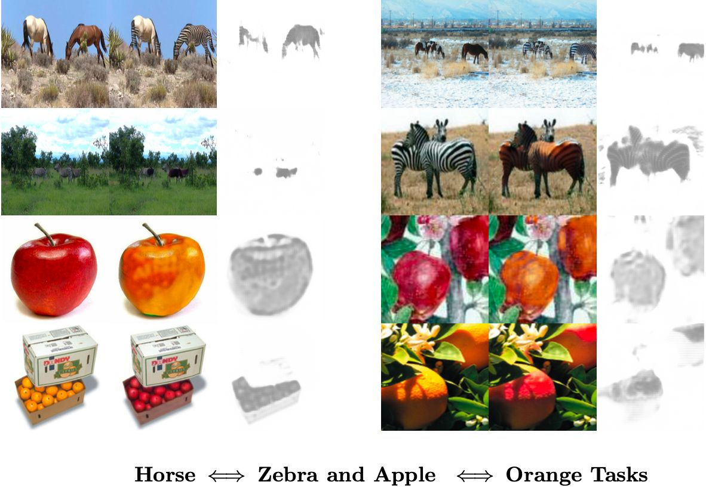
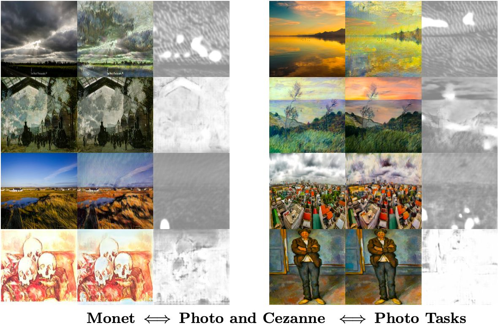
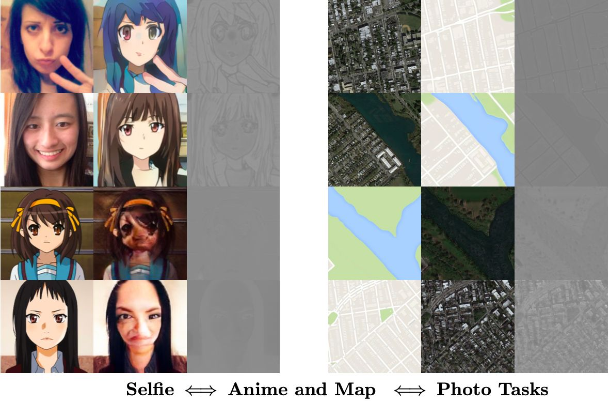

# Attention GANs

This GitHub repository contains the results, emulated code (using pre-trained networks), presentation slides, and report for our Computer Vision Final Project, where we explored and implemented the "Unpaired Image-to-Image Translation using Attention-guided Generative Adversarial Network" by Hao Tang, Hong Liu, Dan Xu, Philip H.S. Torr, and Nicu Sebe.

Original Repo Link: https://github.com/Ha0Tang/AttentionGAN/tree/master/AttentionGAN-v1

Original Paper Link: https://arxiv.org/pdf/1903.12296.pdf

## Some Results

## Presentation Slides

Here is the link to the [Presentation Slides](https://github.com/sampadk04/GANs/blob/main/Attention_GAN/slides/CVSN_Project_Presentation.pdf).

## Final Report

Here is the link to the [Final Report](https://github.com/sampadk04/GANs/blob/main/Attention_GAN/report/CVSN_Project_Report.pdf).