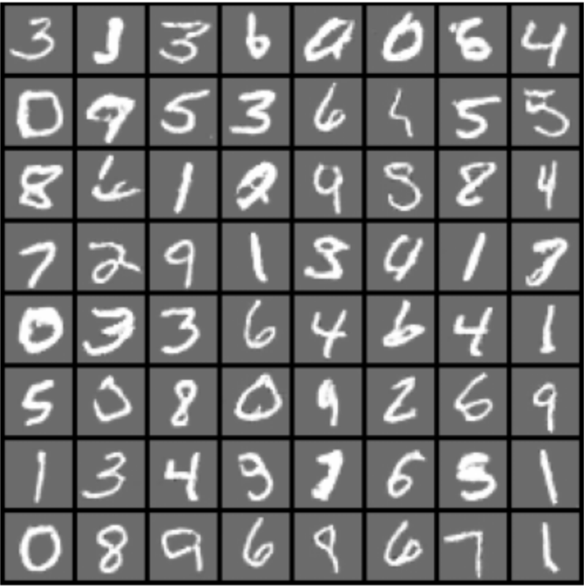

# Deep Convolutional Generative Adversarial Networks
A DCGAN uses deep convolutional networks to improve the quality of generated images. It replaces fully connected layers with convolutional layers, which helps in capturing spatial hierarchies in images, resulting in more realistic outputs.

## Example Output:

**Resources:**
- [Original Paper](https://arxiv.org/pdf/1511.06434)